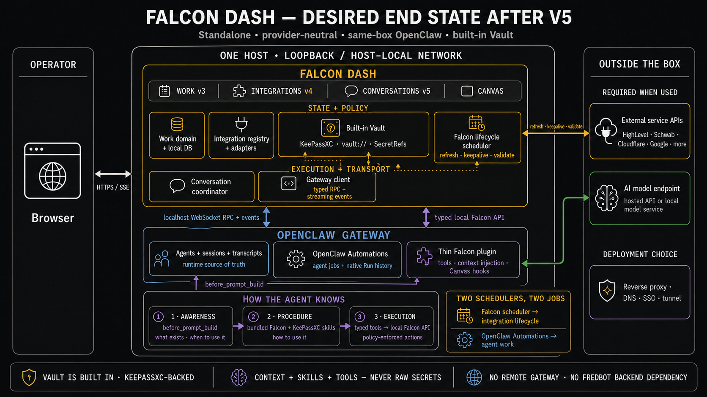

# Falcon Dash Roadmap

This document separates the current product from approved future work. It is the source for version
sequencing; it does not claim that future modules already ship.

## Current: v3 — Work

Finish and stabilize the Work module as the shared human-and-agent source of truth:

- rigorous Work domain, event history, relationships, provenance, and authority semantics;
- Work overview, Projects, Needs Resolution, Automations, Browse, and object-specific detail pages;
- agent-facing `/api/v3`, `falcon` CLI, and bounded session-start Work context;
- current OpenClaw native cron jobs represented as Work Automations without creating a second copy.

The approved semantic contracts live in [Technical/v3/](Technical/v3/README.md). The current implementation
overview lives in [Technical/work-management.md](Technical/work-management.md).

## v4 — Integrations

Add a live integrations control surface and execution layer over the built-in Falcon Dash vault:

- structured provider/account records, purpose, capabilities, scopes, expiry, health, validation,
  audit history, and reauthorization procedure;
- provider adapters for validation, refresh, keepalive, rotation, and approved manual actions;
- an internal Falcon Dash scheduler for credential lifecycle work;
- first representative patterns: HighLevel rotating OAuth, Cloudflare static-token validation, and
  Schwab keepalive;
- safe agent tools and bounded context that explain what integrations exist and how to use them.

Falcon Dash lifecycle schedules are not OpenClaw cron jobs. They have separate ownership,
persistence, execution, and failure semantics even if a future UI presents both coherently.

The KeePassXC vault is built in, not an optional external integration. Raw credentials remain
server-side behind SecretRefs and scoped operations.

## v5 — Contextual agent conversations

Expose OpenClaw agent sessions inside Falcon Dash where the work already lives:

- project- and object-contextual conversation entry points;
- a rich conversation surface with strong Markdown, graphs, equations, file uploads, voice notes,
  tool activity, approvals, and durable session references;
- optional canvas experiences wired into the same session UI when the task benefits from them;
- the gateway client as the native session/event transport;
- the Falcon Dash plugin for bounded Work, integration, vault-usage, and surface context.

OpenClaw remains the source of truth for sessions and transcripts. Falcon Dash stores contextual
references and presentation state, not a competing transcript database. This should make separate
conversation channels less necessary without making Discord or other providers product
prerequisites.

## Later: v6 — Dedicated mobile experience

Dedicated mobile information architecture follows the Work, Integrations, and conversation models.
The existing responsive shell is current behavior; the roadmap does not require v3 through v5 work
to invent the v6 mobile product early.

## Desired post-v5 system

Falcon Dash and OpenClaw run on the same box. Remote gateway support and any dependency on a
provider-specific backend are outside the supported product boundary.

The integration points are deliberate:

- **Gateway client:** native OpenClaw RPCs, events, sessions, approvals, and cron operations.
- **Falcon Dash plugin:** bounded agent context and Falcon-specific tools or surfaces.
- **Built-in vault:** KeePassXC storage plus server-side SecretRef resolution.
- **Two schedulers:** OpenClaw runs native agent Automations; Falcon Dash runs integration lifecycle
  jobs.
- **External dependencies:** provider APIs, model/tool services used by OpenClaw, and optional chat
  providers. No external Falcon Dash control plane or external vault is required.
