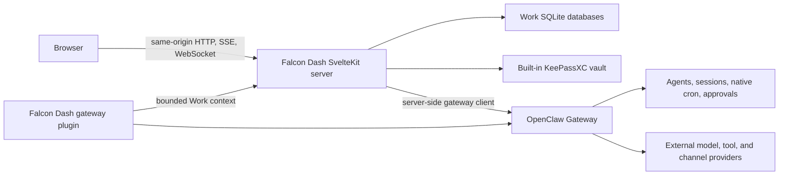

# Architecture

This document describes the current Falcon Dash implementation. Approved future modules are kept
separately in [../ROADMAP.md](../ROADMAP.md).

## Supported topology

Falcon Dash is a standalone application that runs on the same host as an OpenClaw Gateway. It does
not require fredbot-backend or another Falcon control plane. A process installation normally uses
loopback; containers on the same machine may use a private container network. Connecting to a
gateway on another host is intentionally unsupported.

The browser never connects directly to OpenClaw and never receives the gateway token. Falcon Dash
resolves gateway configuration, authenticates, and maintains the upstream WebSocket on the server.

## Runtime components

### SvelteKit application

Routes and page servers live in `src/routes/`. Shared UI lives in `src/lib/components/`. The root
layout starts browser subscriptions and selects the desktop or narrow-viewport shell.

Current primary modules are:

- **Work** — the default route and v3 work-management UI;
- **Vault** — KeePassXC entry and group management;
- **Channels** — Discord and Telegram readiness/setup, with WhatsApp shown only as unwired status;
- **Labs / Settings** — gateway, agent, workspace, diagnostics, approvals, terminal, and other
  advanced surfaces.

Documents, Jobs, Skills, Agents, global Approvals, Operations, and Heartbeat also remain routable
current surfaces. Falcon Dash does not currently have an in-product agent conversation route;
contextual conversations are a v5 target.

### Work domain

`src/lib/server/work3/` owns canonical Work data, command validation, authority checks, derived
readers, relationships, source resolution, and the outbox-to-event-log pipeline.

- `work3.db` stores canonical entities and the transactional outbox.
- `work3-events.db` stores the append-only event log.
- `/api/v3/**` is the bearer-authenticated agent interface.
- `/api/work3/events` streams post-commit invalidations to the browser.
- Work page servers call the same readers and command engine for human actions.
- The `falcon` CLI is a packaged client of `/api/v3`.

OpenClaw native cron definitions and runs remain owned by OpenClaw. Falcon Dash composes them with
Work metadata as Automations; it does not create a second runtime definition.

### Gateway client

`src/lib/server/gateway-client.ts` is the one long-lived OpenClaw connection. It performs
challenge-response authentication, negotiates protocol v3–v4, correlates RPC responses, maintains
the hello snapshot, follows tick liveness, and reconnects with backoff.

The browser uses two same-origin adapters:

- `POST /api/gateway/rpc` for RPC calls;
- `GET /api/gateway/events` for the snapshot, connection state, and gateway events over SSE.

`/api/gateway/proxy` forwards the native Gateway Control UI. Production WebSocket upgrades for
that proxy and `/terminal-ws` are attached by `src/entry.js`.

### Gateway plugin

The gateway client and plugin have different jobs:

| Integration           | Use it for                                                               | Do not use it for                                                       |
| --------------------- | ------------------------------------------------------------------------ | ----------------------------------------------------------------------- |
| Native gateway client | OpenClaw RPCs, events, sessions, approvals, native cron, config          | Falcon-specific context or capabilities OpenClaw does not define        |
| Falcon Dash plugin    | bounded prompt context, Falcon-specific tools, canvas/channel extensions | duplicating standard gateway transport or owning OpenClaw runtime state |

The repo currently versions `gateway-plugin/brief-context.js`, which fetches a bounded Work brief
for prompt injection. Full standalone packaging of the companion extension remains an installation
gap; see [gateway-plugin.md](gateway-plugin.md).

### Packaged agent skills

The npm package installs three namespaced OpenClaw runtime skills: `falcon-dash` for concise product
orientation, `falcon-dash-work` for current v3 reads and commands, and `falcon-dash-vault` for Vault
and SecretRef handling. The installer uses an explicit allowlist. Repository development guidance
stays in `AGENTS.md` and `docs/` so frontend, testing, or other developer-only instructions are not
injected into end-user agents.

### Built-in vault

`src/lib/server/vault/vault.ts` wraps `keepassxc-cli` against
`~/.openclaw/passwords.kdbx` using `~/.openclaw/vault.key`. Vault APIs are same-origin and
server-side. `bin/keepassxc-secret-resolver.cjs` exposes the same vault to OpenClaw through its exec
SecretRef protocol.

KeePassXC is part of Falcon Dash's product architecture. The current implementation still expects
the binary, database, and key file to be provisioned; installation must automate that before it can
claim a complete first-run experience.

## Startup and data flow

`src/hooks.server.ts` starts Work, the Work outbox worker, the gateway client, security headers,
optional Sentry, and the development terminal server. In production, the adapter-node server is
wrapped by `src/entry.js` for WebSocket upgrades.

A typical gateway read follows this path:

1. The browser calls a same-origin route or subscribes to SSE.
2. The SvelteKit server checks the gateway client state.
3. The server issues a typed OpenClaw RPC with a 30-second timeout.
4. The response returns to the browser; later gateway events flow through the SSE bridge.

A Work mutation instead executes in the local command engine, writes canonical data and an outbox
record in one transaction, then transfers the event to the append-only log. Browser Work views
invalidate from the local Work SSE stream and reread server-derived state.

## Trust and failure boundaries

- Gateway tokens, agent bearer tokens, and vault values stay server-side.
- Agent authority comes from a verified bearer token; human authority comes from the trusted
  same-origin UI path and recorded source evidence, never caller-supplied labels.
- Gateway unavailability degrades gateway-backed surfaces without changing Work lifecycle state.
- Plugin context injection is bounded, cached, short-timeout, and best-effort so Falcon Dash cannot
  block every agent prompt.
- The Work event log is durable history; SSE streams are invalidation channels, not persistence.
- External provider APIs are required only by the OpenClaw capabilities or future integrations the
  installation chooses to use. No external Falcon Dash backend or external vault is required.

## Future boundary

v4 adds Falcon-owned integration lifecycle records and a separate internal scheduler. v5 adds
contextual OpenClaw conversations without copying transcripts. Those targets are architecture
constraints in [../ROADMAP.md](../ROADMAP.md), not current runtime components.
